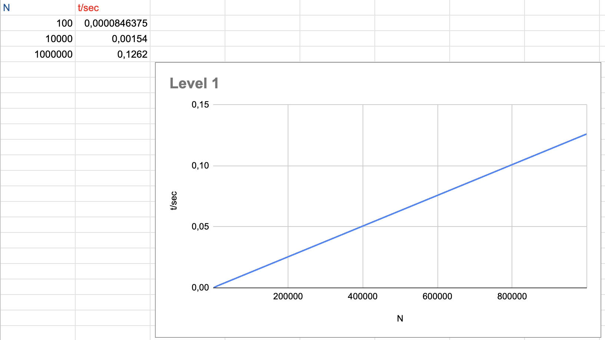
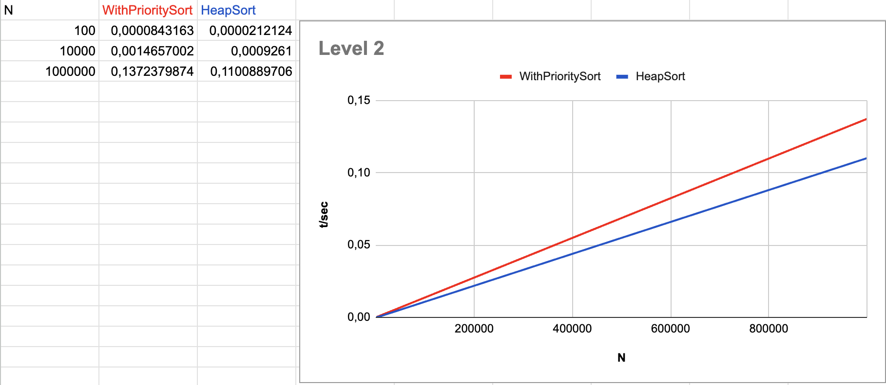
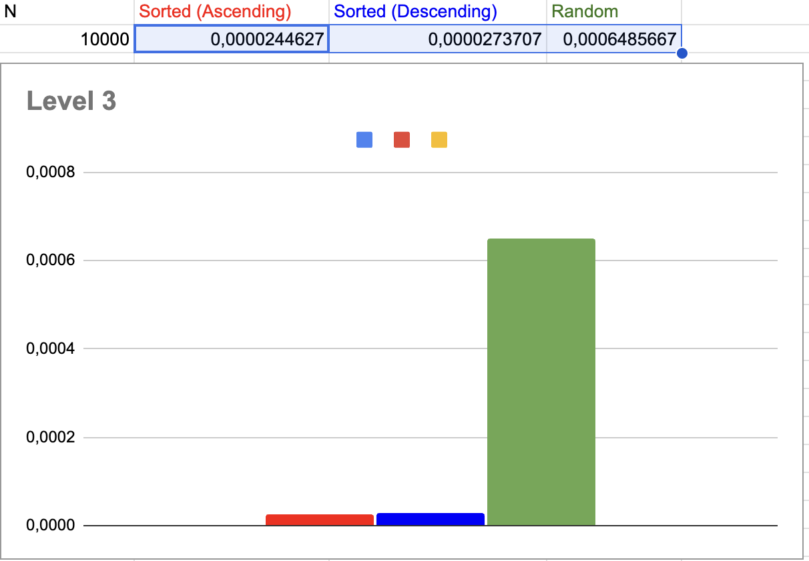

# Level 1: Priority Queue Sorting

---

# Level 2: Comparison of Sorting Methods

Comparison of:
- Priority Queue-based sorting
- Classic Heap Sort

---

# Level 3: Data Order Impact

Comparison of algorithm performance depending on input data order:
- Sorted (Ascending)
- Sorted (Descending)
- Random

