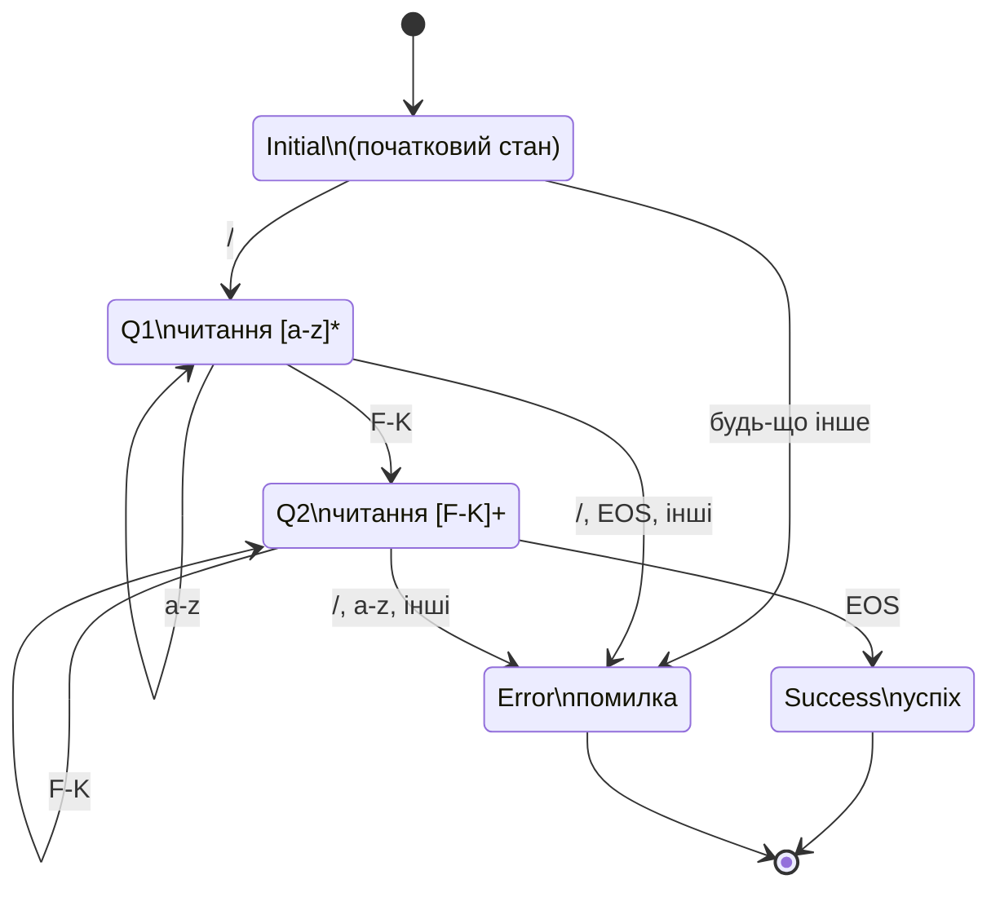

#### 1. Таблиця переходів (завдання 2)
| Поточний стан | Slash (/) | LowerLetter (a-z) | SpecialUpper (F-K) | EOS (Кінець рядка) | ANY (Будь-який інший символ) |
| :--- | :---: | :---: | :---: | :---: | :---: |
| **Initial** | Q1 | Error | Error | Error | Error |
| **Q1** | Error | Q1 | Q2 | Error | Error |
| **Q2** | Error | Error | Q2 | Success | Error |
| **Success** | Error | Error | Error | Error | Error |
| **Error** | Error | Error | Error | Error | Error |

#### 1. Граф (завдання 2)
