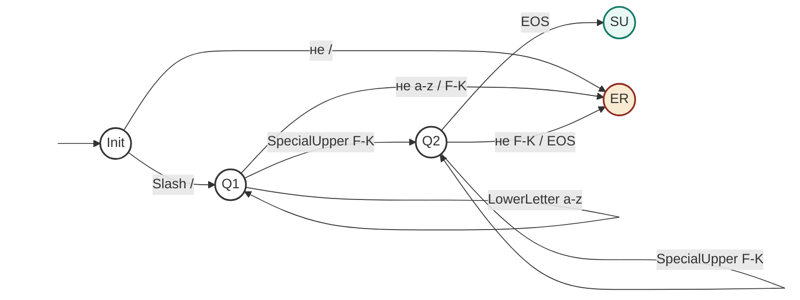

#### Граф (завдання 2)

```mermaid
graph LR
    %% Стилізація станів
    classDef default fill:#fff,stroke:#333,stroke-width:2px;
    classDef success fill:#e8f8f5,stroke:#117a65,stroke-width:2px;
    classDef error fill:#f9ebd2,stroke:#922b21,stroke-width:2px;

    %% Початкова стрілка
    Start[ ] --> |" " | Init((Init))
    style Start fill:none,stroke:none

    %% Основні стани
    Init --> |Slash /| Q1((Q1))
    Q1 --> |LowerLetter a-z| Q1
    Q1 --> |SpecialUpper F-K| Q2((Q2))
    Q2 --> |SpecialUpper F-K| Q2
    Q2 --> |EOS| SU((SU))

    %% Стани помилки (ER)
    ER((ER))
    Init --> |не /| ER
    Q1 --> |не a-z / F-K| ER
    Q2 --> |не F-K / EOS| ER

    %% Застосування стилей до фінальних станів
    class SU success;
    class ER error;
```
